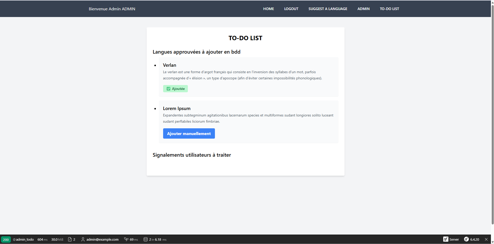

# Linguarum

Linguarum est une application web développée avec Symfony 6.4, permettant d’explorer l’arbre généalogique des langues parlées dans le monde. Elle propose une visualisation hiérarchique (récursive) des relations entre langues, la gestion d’un back-office, ainsi qu’un système de contribution communautaire.

## Fonctionnalités clés

### Exploration interactive des langues

Affichage d’un arbre généalogique des langues via une structure récursive. Chaque langue peut contenir des sous-langues et être liée à une langue parente.

### Pages de détail pour chaque langue

Description détaillée, liens vers langues parentes et enfants, navigation fluide dans la hiérarchie linguistique.

### Système d’authentification

Connexion différenciée pour les utilisateurs et l’administrateur, avec redirections personnalisées selon le rôle.

### Back-office avec EasyAdmin

Gestion des utilisateurs, langues, propositions de langues, avec affichage des relations via noms plutôt que simples IDs.

### Contribution communautaire et workflow utilisateur

- Les utilisateurs peuvent s’inscrire puis se connecter.
- Une fois connecté, un utilisateur peut proposer de nouvelles langues via un formulaire dédié.
- Chaque proposition est soumise à une pré-approbation par l’administrateur via son interface CRUD.
- Une fois pré-approuvée, la proposition rejoint une to-do-list d’administration.
- Dans cette to-do-list, l’administrateur décide d’ajouter manuellement la langue en base de données, validant ainsi officiellement la langue.
- Cette to-do-list servira aussi à l’avenir pour gérer d’autres tâches administratives.

### Recherche dynamique

Barre de recherche permettant de trouver rapidement une langue selon son nom ou sa description.

### Fixtures enrichies et organisées

Données linguistiques classées par familles (ex. : indo-européennes, sino-tibétaines, austronésiennes, etc.) injectées via fixtures Symfony.

## Aspects techniques

### Technologies utilisées

- Symfony 6.4 WebApp
- TailwindCSS pour le style
- Faker pour la génération de données de test
- EasyAdmin pour l’administration
- Doctrine ORM
- Twig

### Décisions techniques clés

- Suppression des dépendances Stimulus UX et Doctrine Messenger pour simplifier le projet.
- Tentatives de récupération de données via scraping (Wikipedia) et APIs (Glottolog, Wikidata) mises en pause faute de temps ou résultats satisfaisants.
- Recours temporaire à des fixtures manuelles enrichies.
- Architecture MVC respectée pour une structure claire du code.

## Ce qui reste à développer

- Intégration d’une traduction automatique via API (LibreTranslate ou autre).
- Visualisation graphique avancée de l’arbre (exemple : diagrammes dynamiques).
- Pagination et optimisation des performances pour gérer de très grands ensembles de langues.

## Captures d'écran

Voici une capture d'écran de la visualisation de l'arbre des langues et la barre de recherche :


Voici une capture d'écran de la page de connexion :


Voici une capture d'écran de la page d'inscription :


Voici une capture d'écran de la homepage en étant connecté :


Voici une capture d'écran de la page de proposition de langue :


Voici une capture d'écran de la page du CRUD d'admin :


Voici une capture d'écran de la page du TODO d'admin :



## Installation

```bash
# Cloner le dépôt
git clone https://github.com/Amr69130/sf-linguarum.git

# Installer les dépendances
composer install

# Configurer son acces bdd
creer un fichier .env.local à la racine et definir son propre DATABASE_URL

# Créer la base de données
php bin/console doctrine:database:create

# Exécuter les migrations
php bin/console doctrine:migrations:migrate

# Charger les fixtures
php bin/console doctrine:fixtures:load

```

# Contribution

Les contributions sont les bienvenues ! N’hésitez pas à ouvrir une issue ou soumettre une pull request.
